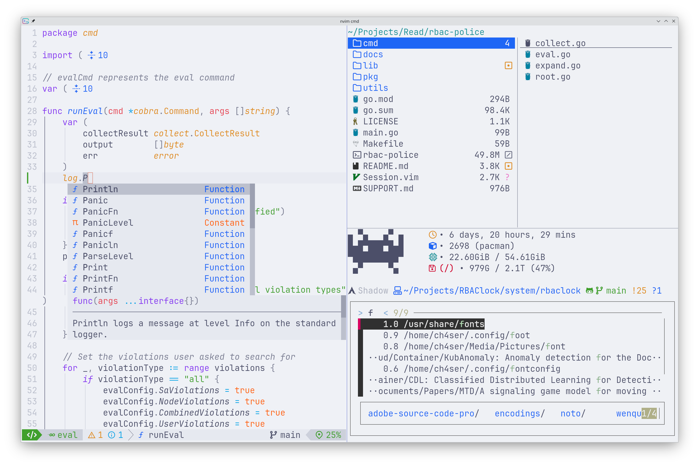
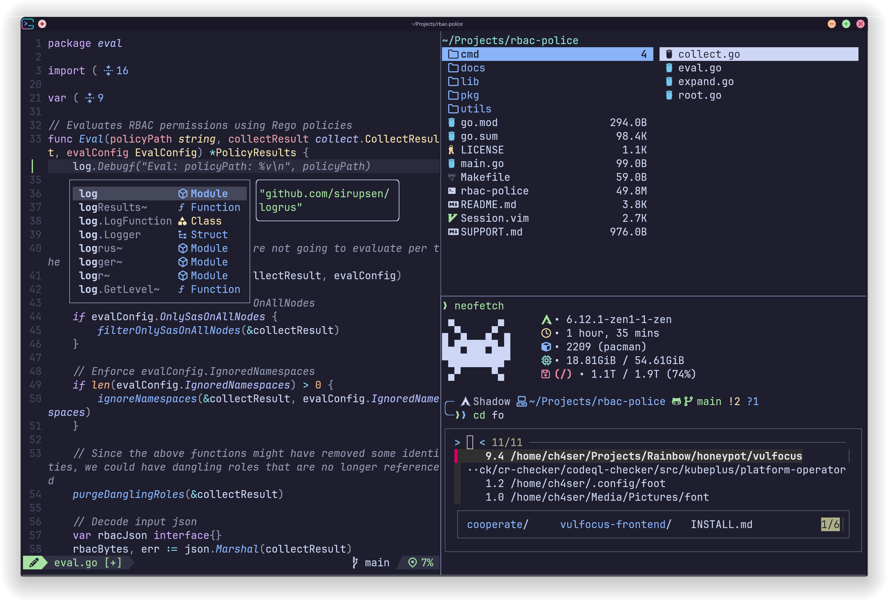

# Development Toolkit 📡

A simple, comprehensive and user-friendly development toolkit to boost up your productivity 🚀.





- terminal emulator: [kitty](https://github.com/kovidgoyal/kitty)
- shell: [zsh](https://www.zsh.org/)
- editor: [neovim](https://github.com/neovim/neovim)
- terminal filemanager: [yazi](https://github.com/sxyazi/yazi)

## Try

```bash
docker run -it --rm --name dev ch4xer/dev:latest /bin/zsh
```

## Install

```bash
git clone https://github.com/ch3n9w/dev
cd dev
# install dependency software and install configuration
./scripts/install-software.sh
```

Alternatively (if you dont want to install all of them), you can copy the configuration directory you like to `XDG_CONFIG_HOME` (commonly `~/.config`), for example:

```
nvim -> ~/.config/nvim
kitty -> ~/.config/kitty
yazi -> ~/.config/yazi
zsh/zsh -> ~/.config/zsh
zsh/zshrc -> ~/.zshrc
zsh/zimrc -> ~/.zimrc
```

## Noteable Info

- Kitty
  - use `Ctrl` and `Shift` as modifier key for all shortcuts
  - use JetbrainMono Nerd Font and LXGW WenKai as font
- Zsh
  - you can add software settings in `zsh/zsh/software`
  - disable vim mode.
- Neovim
  - Based on LazyVim, with some simplifications to make it more tiny and user-friendly
  - Good support for Neovide (fixed gui color & keymap)

## Theme

The default theme of the toolkit is `catppuccin-latte`, if you want to change to dark theme:

- modify `kitty/kitty.conf`, replace `include latte.conf` with `include mocha.conf`
- modify `nvim/lua/plugins/colorscheme.lua`, replace `flavour = "latte"` with `flavour = "mocha"`.

## Critical Keymap

Please check the configuration file for the complete key mapping. Here we only record some of the more frequently used ones.

|   Software   |      Key       |                Effect                 |
| :----------: | :------------: | :-----------------------------------: |
|    kitty     |      C-t       |                new tab                |
|    kitty     |      C-CR      |              new window               |
|    kitty     |      C-w       |             delete window             |
| kitty/neovim |      C-n       |          new terminal window          |
| kitty/neovim |   C-h/j/k/l    |          focus other window           |
|    kitty     |  C-S-h/j/k/l   |              move window              |
|    kitty     |  C-PgUp/PgDn   |            goto other tab             |
|    kitty     | C-S-PgUp/PgDn  |               move tab                |
|    kitty     |     C-=/-      |           adjust font size            |
|     zsh      |      C-r       |           call filemanager            |
|     zsh      |  C-Backspace   |         delete word backward          |
|     yazi     |       gh       |            go to home (~)             |
|     yazi     |       gn       |           go to ~/Downloads           |
|     yazi     |      H/L       | go to previous/next visited directory |
|     yazi     |       a        |            create file/dir            |
|     yazi     |       r        |       rename file or directory        |
|     yazi     |       .        |           show hidden file            |
|     yazi     |       y        |                 copy                  |
|     yazi     |       d        |                  cut                  |
|     yazi     |       p        |                 paste                 |
|     yazi     |     Delete     |         move file to trashcan         |
|     yazi     |       f        |       search and jump with fzf        |
|     yazi     |       z        |           jump with zoxide            |
|    neovim    |       q        |          quit window/neovim           |
|    neovim    |      H/L       |      go to the begin/end of line      |
|    neovim    |       ;        |        enter commandline mode         |
|    neovim    | 2-LeftMouse/CR |              toggle fold              |
|    neovim    |       sw       |              search word              |
|    neovim    |       sd       |          search diagnostics           |
|    neovim    |       se       |             File Explorer             |
|    neovim    |       ss       |                Symbols                |
|    neovim    |       sb       |            search buffers             |
|    neovim    |   Tab/S-Tab    |           Next/Prev buffer            |
|    neovim    |       ga       |           (lsp) code action           |
|    neovim    |       ge       |    (lsp) show diagnostics in line     |
|    neovim    |       gn       |          (lsp) rename symbol          |
|    neovim    |       gd       |        (lsp) go to definition         |
|    neovim    |      C-/       |             comment line              |
|    neovim    |     <C-`>      |            Toggle Terminal            |
